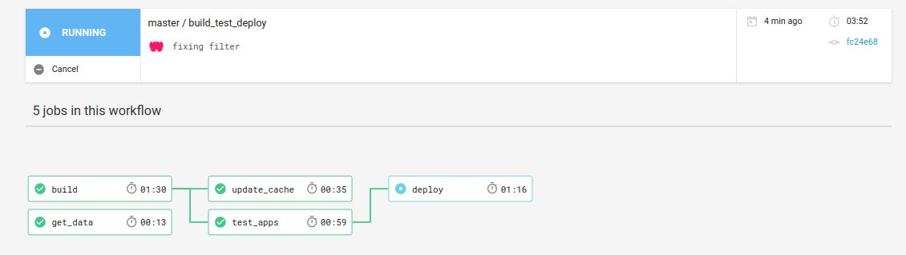

Hi friends! Welcome to the documentation for the [Scientific Filesystem Container Builder](https://www.github.com/vsoch/example.scif) example. This documentation
and associated repository will help you to turn your scientific software into a tested, reproducible container to share with others. We are going to be combining three technologies to handle each of the following:

 - **Reproducibility** of software is handled by container technology
 - **Discoverability** and **Transparency** are handled by installing our software in the container via a [Scientific Filesystem](https://sci-f.github.io). SCIF also lets us install the same dependencies across container technologies.
 - **Testing** is handled by continuous integration, which understands how to interact with a scientific filesystem.

Each of these components plays a slightly different and equally important role. Without [SCIF](https://sci-f.github.io), we wouldn't have any consistency in the commands that we can execute to the container to discovery the software. Without container technologies, you could install software on your host, but (as we all know) this would likely not be a portable solution. Without testing, we couldn't be sure that our software works as we intended, and is ready to plug into some pipeline tool. The template repository here will help you create a workflow with these steps:

that will ensure your software is packaged, tested, and ready for use! To get started, follow each of the links below to learn how to generate your own his will be consolidated into a tutorial, and for now follow the links below:

## Getting Started

 - [1. Clone the Repository](/setup): The first step is to clone this repository to your Github account.
 - [2. Write Your Recipe](/recipes): The container build and testing is driven by defining your Scientific Filesystem in a [recipe.scif](recipe.scif)
 - [3. Build a Container](/bulid): (optional) you will likely want to build a container, either to develop or run locally.
 - [4. Testing Criteria](/testing): Once you push to Github, you will need to connect to a Continuous Integration service ([CircleCI](https://circleci.com/gh/vsoch/example.scif/) is used for this repository.

After you write your recipe, making sure to add your scripts and other dependencies to this repository, connect it to test on Circle, and the tests pass, the container will be deployed for others to use.

## Continued Development
After setup, you will still want to add new features and otherwise update your software. But since others are likely using it, you need to do this carefully! Here we will give some advice to do this.

 - [Github Development](/development): if you aren't familiar with the Github flow to checkout branches for new features and changes.
 - [Using the Container](/usage): How to interact with the SCIF in your container, after you've developed it.
 - [Example](example.md): a concrete usage example for the recipe provided in this repository, which has samtools, cufflinks, tophat, and bowtie.

## Additional Resources
 - [https://sci-f.github.io](https://sci-f.github.io) Scientific Filesystem documentation base
 - [Scientific Filesystem Publication](https://academic.oup.com/gigascience/article/7/5/giy023/4931737) in Gigascience
 - [Background](background.md) a bit of background about why we would want to use SCIF in containers, if you don't want to look over the manuscript.

## Need Help?

If you need help, please don't hesitate to [reach out](https://www.github.com/vsoch/example.scif/issues) and we will help you!

  
  

   

   <!-- Parse news-->
   
   
   

      <h2><a class="post-link" href="{{ post.url | remove: "/" }}">{{ post.title }}</a></h2>
      {{ post.date | date: "%b %-d, %Y" }}
      
{{ post.content | truncatewords: 20 | strip_html }}
  
   

   

   
   
   

      <h2><a class="post-link" href="{{ post.url | remove: "/" }}">{{ post.title }}</a></h2>
      {{ post.date | date: "%b %-d, %Y" }}
      
{{ post.content | truncatewords: 20 | strip_html }}
  
   

   
   

  

